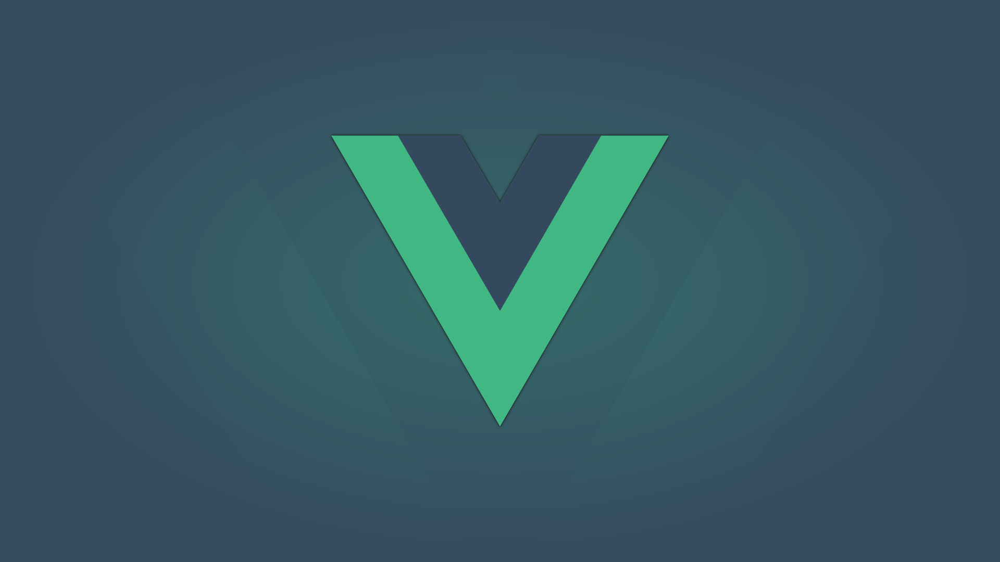

# Vue Finances (monorepo)

Monorepo para API GraphQL e Aplicação Vue.

A aplicação é um Gerenciador de Finanças Pessoais que usa as seguintes tecnologias e recursos:

* Client Side
  * Vue (2.6+)
  * Vue Router
  * Vuex
  * Vuetify
  * Vuelidate
  * Apollo Client
  * Apollo Cache InMemory
  * ChartJS
  * Moment
  * RxJS

* Server Side
  * NodeJS
  * Prisma (Client e Binding)
  * GraphQL Yoga
  * Moment
  * JSON Web Tokens
  * Bcrypt
  * API GraphQL (Queries e Mutations)
  * PM2

* Outras ferramentas
  * Docker (Compose e Machine)
  * Prisma Server
  * PostgreSQL
  * Traefik (Reverse Proxy)
  * Digital Ocean
  * Let's Encrypt (HTTP/TLS)
  * Git Submodules
  
